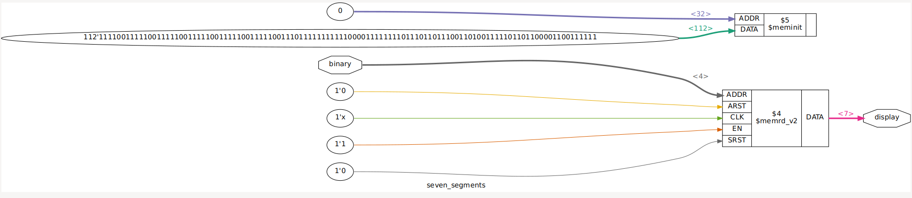
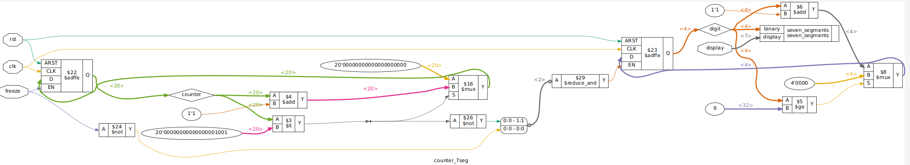
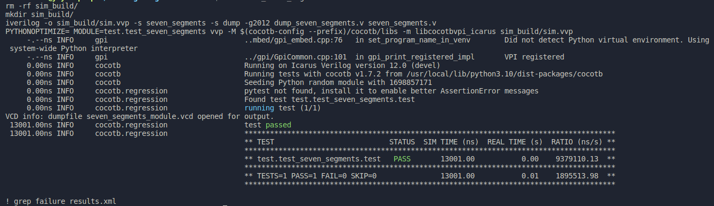
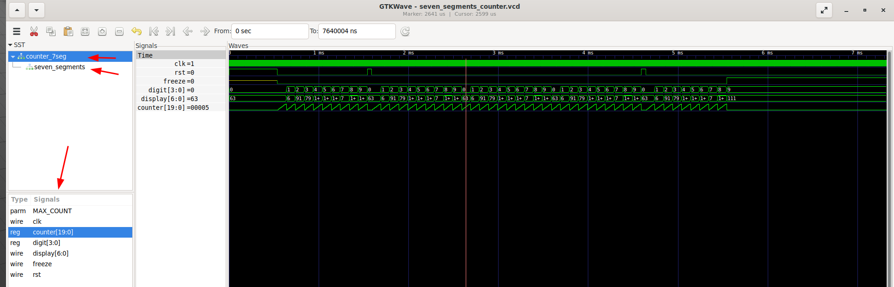
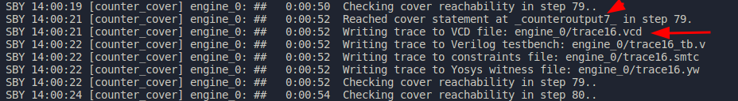
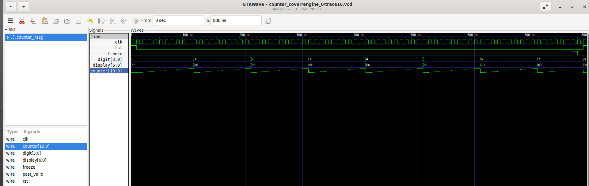

# Very simple Verilog 7-segments counter

Implements a very simple 7-segments display counter intended to receive a 1 MHz Clock signal increase display digit in one every second (counting 1 million clock cycles so "second" precision depends on clock precision).

## Seven Segments Module:

This is a very simple combinational-logic 7-Segments display driver, it only receives a nibble representing the digit to be shown in the display and outputs the corresponding 7-segments mapping, if a value not in [0-9] is included an E will be shown in the display.

Includes CocoTB test and formal verification covers for demonstrational purposes only. Observe that, to avoid fails of the formal test over the counter that uses this module, the last cover was disabled as it never can be reached in normal operation.

All commands ending in _seven_segments in the Makefile are targetting this module alone.

## Counter Module:

This is the Top module of this design and instantiates the seven_segments module.

This module receives the Clock, a Reset and a Freeze signal, this last one meant to stop counting even when the Clock is going and the reset is set to low, when Freeze goes back to low then it should resume counting where it stopped (TODO: include test cases for the resume).

Includes CocoTB test and formal verification covers for demonstrational purposes only.

All commands ending in _counter in the Makefile are targetting this module and the seven_segment must be included.

## Synthetizing with YoSys:

Run:

```
make synth_seven_segments
```

and you should see a YoSys window opening showing the synthesis like this:



By running:

```
make synth_counter
```

you should see a synthesis like this:



observe this synth does not use standard cells.

## Running CocoTB tests:

Type the following command to run tests:

```
make test_seven_segments
make test_counter
```

For the case of the seven segments test you should see a result like this:



Observe in the Makefile that a dump_*.v file is included for every test command, in those files, the output file and the variables to be dumped (the name of the Top module in each case) are defined, after running the test the corresponding .vcd (value change dump) files are created and you can proceed to view those with the GtkWave commands:

```
make gtkwave_seven_segments
make gtkwave_counter
```

a GtkWave window will open, you should see the hierarchy of the counter containing the seven segments module, when clicking on one of the hierarchical levels you will see the available signals that can be displayed for examination, like in our case we're viewing the clk, rst, freeze, digit (internal), display and counter (internal) this last one being shown in analog/step format to see the period:



observe that for this case we're not using a verilog testbench but rather we're testing directly (Design Under Test or DUT for CocoTB) the corresponding modules.

## Running Formal Verification:

We defined formal verification covers for every module, the corresponding .sby module define configuration for solvers, the cover statements are found in each module's .v file.

When running the corresponding Formal Verification command for each module:

```
make formal_seven_segments
make formal_counter
```
a folder named MODULE_cover will be created (MODULE being seven_segments or counter), inside all files generated by the sby will be placed and the .vcd file for every cover statement will be shown in the console:



Then you can type:

```
gtkwave counter_cover/engine_0/trace16.vcd
```

and you can see the signals generated by the solver:



observe that from the last command the trace number may vary from run to run so you must pay attention to which case you want to examine and find the corresponding trace number.
